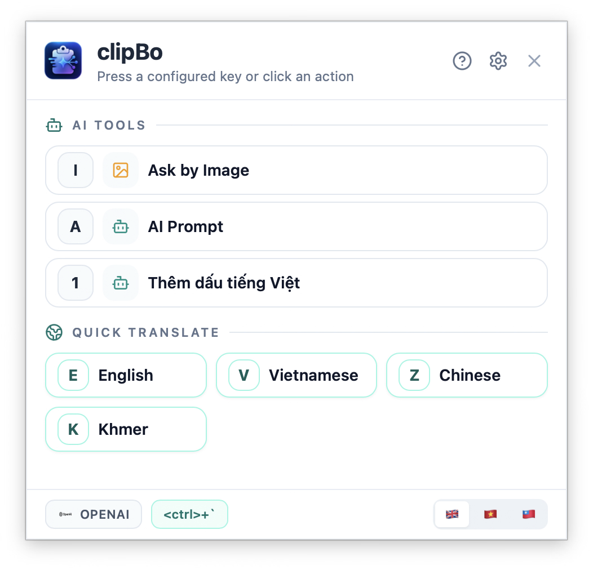
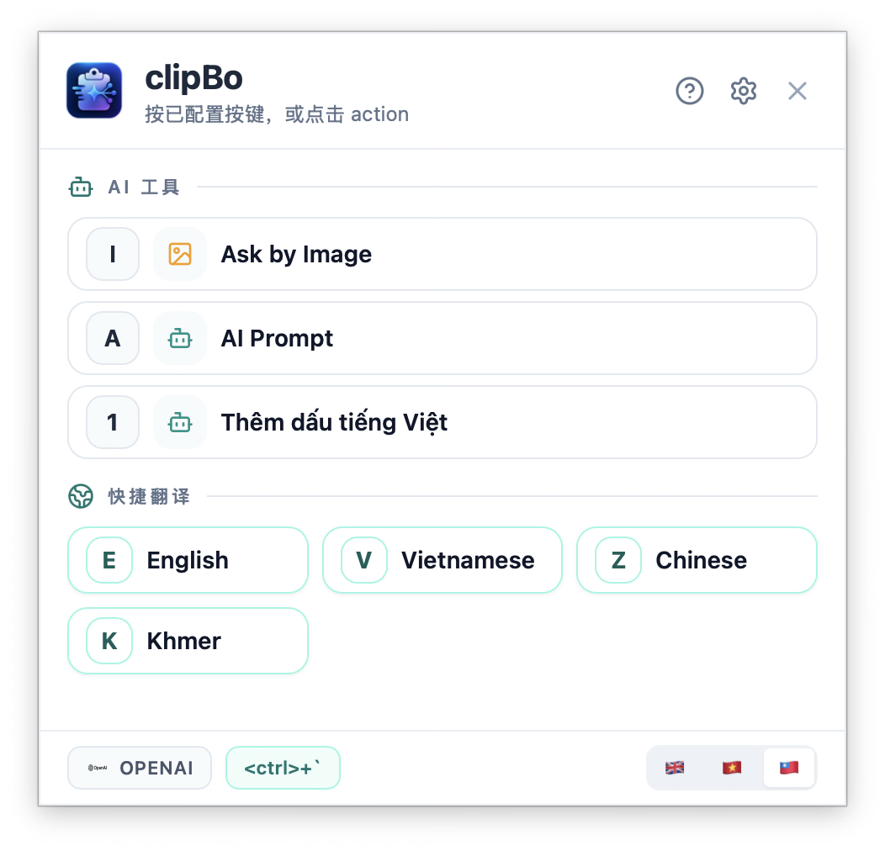

# ClipBo

<p align="center">
  <strong>Open-source AI Smart Actions for clipboard, selected text, and screenshots.</strong>
</p>

<p align="center">
  <a href="#english">English</a> ·
  <a href="#vietnamese">Tiếng Việt</a> ·
  <a href="#chinese">中文</a>
</p>

---

<a id="english"></a>
## English

**ClipBo** is a free and open-source desktop app that turns your clipboard, selected text, and screenshots into instant AI actions.

Built with **React / Vite + Tauri / Rust**.

### Screenshots
<p align="center">
  
</p>

### Features
- Global AI action popup
- Smart Action CRUD
- AI Prompt (one-shot + chat)
- Ask by Image (clipboard image + ROI capture)
- Gemini / OpenAI-compatible / Ollama
- Clipboard copy & pasteback
- macOS permissions flow
- Multilingual defaults (EN/VI/ZH)

### Release
- Public beta release is available on GitHub Releases: `v0.1-beta`.

### macOS Note (Important)
- ClipBo is currently free and open-source, and **not notarized yet**.
- On macOS, you may see a security warning when opening the app for the first time.

### Platform Plan
- Linux (Ubuntu) support is in active development.
- Windows 11 support is planned soon.

### Development
```bash
chmod +x run.sh
./run.sh
```

Or:

```bash
. "$HOME/.cargo/env"
cd webui
npm install
npm run tauri:dev
```

Build:

```bash
cd webui
npm run tauri:build
```

### License
MIT License.

---

<a id="vietnamese"></a>
## Tiếng Việt

**ClipBo** là app desktop miễn phí, mã nguồn mở, giúp biến clipboard, selected text và screenshot thành AI Smart Actions dùng ngay bằng hotkey.

Xây dựng với **React / Vite + Tauri / Rust**.

### Ảnh giao diện
<p align="center">
  
</p>

### Tính năng
- Popup action toàn cục
- CRUD Smart Action
- AI Prompt (một lần + chat tiếp)
- Ask by Image (ảnh clipboard + ROI)
- Hỗ trợ Gemini / OpenAI-compatible / Ollama
- Copy / pasteback về app đích
- Luồng quyền macOS
- Action mặc định đa ngôn ngữ (EN/VI/ZH)

### Release
- Bản public beta đã có trên GitHub Releases: `v0.1-beta`.

### Ghi chú macOS (Quan trọng)
- ClipBo hiện là app miễn phí, mã nguồn mở và **chưa notarize**.
- Trên macOS, bạn có thể thấy cảnh báo bảo mật ở lần mở đầu tiên.

### Kế hoạch nền tảng
- Bản Linux (Ubuntu) đang được triển khai tích cực.
- Bản Windows 11 cũng đang được lên kế hoạch phát hành sớm.

### Chạy dev
```bash
chmod +x run.sh
./run.sh
```

Hoặc:

```bash
. "$HOME/.cargo/env"
cd webui
npm install
npm run tauri:dev
```

Build:

```bash
cd webui
npm run tauri:build
```

### License
MIT License.

---

<a id="chinese"></a>
## 中文

**ClipBo** 是一个免费开源桌面应用，可将剪贴板、选中文本与截图快速转换为 AI Smart Actions。

基于 **React / Vite + Tauri / Rust** 构建。

### 功能
- 全局 AI 弹窗
- Smart Action 增删改查
- AI Prompt（单轮 + 连续聊天）
- Ask by Image（剪贴板图片 + 区域截图）
- 支持 Gemini / OpenAI-compatible / Ollama
- 剪贴板复制与粘贴回填
- macOS 权限流程
- 多语言默认动作（EN/VI/ZH）

### 界面截图
<p align="center">
  
</p>

### 平台计划
- Linux（Ubuntu）版本正在积极开发中。
- Windows 11 版本也在近期计划中。

### 开发
```bash
chmod +x run.sh
./run.sh
```

或：

```bash
. "$HOME/.cargo/env"
cd webui
npm install
npm run tauri:dev
```

Build:

```bash
cd webui
npm run tauri:build
```

### License
MIT License.
